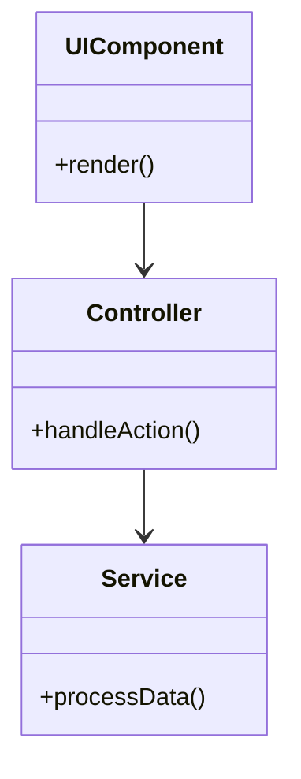
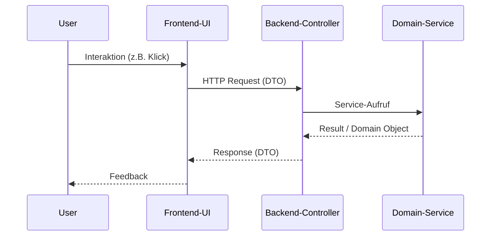
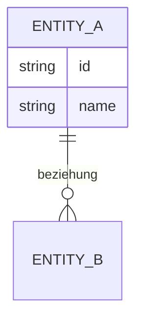

# Implementierungs-Dokumentation: [Feature/User Story Titel]

## 📋 Übersicht
- **User Story / Feature ID:** [z.B. US-001]
- **Datum:** [JJJJ-MM-TT]
- **Status:** [Entwurf / Abgeschlossen]
- **Verantwortlich:** [Name/Rolle]

## 1. 🎯 Kontext & Ziele
*Kurze Beschreibung, welches Problem gelöst wurde und welche Anforderungen (User Story) erfüllt wurden.*
- **Ziel:** [Hauptziel der Implementierung]
- **Referenz:** [Link zur Anforderungs-Doku/Issue]

## 2. 🏗️ Architektur-Überblick
*Kurze Beschreibung der Einordnung in die Gesamtarchitektur (z.B. Bounded Context, Layer).*
- **Betroffene Komponenten:** [z.B. Backend Service, Frontend Web]

## 3. 🧩 Detailliertes Design & Klassen-Struktur
*Beschreibung der Klassen und deren Beziehungen.*

### Klassendiagramm


**Erläuterung:**
- **[Klasse A]:** [Verantwortung der Klasse]
- **[Klasse B]:** [Verantwortung der Klasse]

## 🎬 4. Kommunikationsabläufe
*Darstellung des dynamischen Verhaltens und der Kommunikation zwischen den Objekten.*

### Sequenzdiagramm


**Erläuterung:**
- **Schritt 1:** [Beschreibung des Ablaufs]
- **Schritt 2:** [Beschreibung des Ablaufs]

## � 5. Detaillierte Implementierung

*Erläuterung der wichtigsten Code-Abschnitte (Logic, Filter, State Management).*

### 5.1 Layer: [z.B. View / Controller]
*Beschreibung der Verantwortung (z.B. Eingabe-Handling).*

**Datei:** `[Pfad/zur/Datei.ext]`
```lang
// Code-Ausschnitt (z.B. Methode xyz)
function xyz() {
  // ... Wesentliche Logik ...
}
```

### 5.2 Layer: [z.B. ViewModel / Service]
*Beschreibung der Geschäftslogik oder State-Verwaltung.*

**Datei:** `[Pfad/zur/Datei.ext]`
```lang
// Code-Ausschnitt
```

### 5.3 Layer: [z.B. Data / Repository]
*Beschreibung der Datenbeschaffung und Filterung.*

**Datei:** `[Pfad/zur/Datei.ext]`
```lang
// Code-Ausschnitt
```

## 🗄️ 6. Datenmodell (Optional)
*Falls Datenbank-Änderungen oder neue Entities eingeführt wurden.*

### ER-Diagramm


## �️ 7. Technische Details & Referenzen
- **Design Patterns:** [z.B. Strategy, Observer, Factory]
- **Besondere Herausforderungen:** [Hindernisse und deren Lösung]
- **Wichtige Code-Stellen:**
    - `[Dateipfad](Dateipfad#L10)`

## ✅ 8. Verifizierung & Tests
- **Automatisierte Tests:**
    - Unit Tests: `[Test-Klasse]`
    - Integration Tests: `[Test-Klasse]`
- **Manuelle Test-Szenarien:**
    - [ ] Schritt 1: [z.B. Eingabe von ...]
    - [ ] Schritt 2: [z.B. Erwartete Anzeige ...]

## 🔗 9. Referenzen
- [API-Dokumentation](URL)
- [Architektur-Entscheidungen (ADR)](URL)
