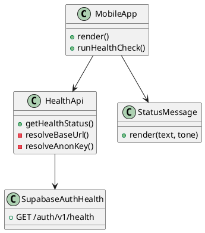
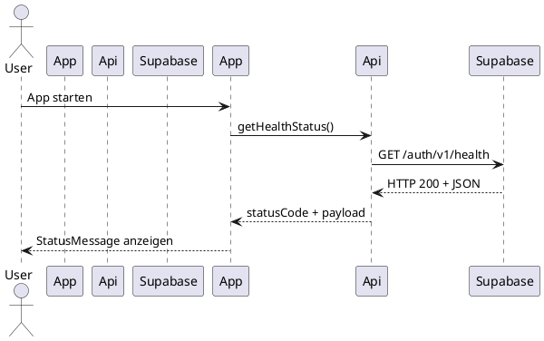

# Implementierungs-Dokumentation: Mobile App Scaffold + Shared UI

## 📋 Uebersicht
- **User Story / Feature ID:** N/A
- **Datum:** 2026-04-28
- **Status:** Abgeschlossen
- **Verantwortlich:** GitHub Copilot

## 1. 🎯 Kontext & Ziele
- **Ziel:** Mobile App Struktur mit Expo einrichten und plattformuebergreifende UI-Komponenten zwischen Web und Mobile teilen.
- **Referenz:** [README](../../README.md)

## 2. 🏗️ Architektur-Ueberblick
- **Betroffene Komponenten:**
  - Mobile App (Expo) in [my-mobile-app](../../my-mobile-app)
  - Shared UI Paket in [shared/ui](../../shared/ui)
  - Web Health UI in [my-app/src/components/SupabaseHealthCheck.jsx](../../my-app/src/components/SupabaseHealthCheck.jsx)

## 3. 🧩 Detailliertes Design & Klassen-Struktur

### Klassendiagramm (PlantUML)


**Erlaeuterung:**
- **MobileApp:** Einstiegspunkt fuer UI und Statusanzeige.
- **HealthApi:** Kapselt Supabase Health Request und Env-Konfiguration.
- **StatusMessage:** Gemeinsame UI-Komponente (Web + Native) fuer Status-Feedback.
- **SupabaseAuthHealth:** Externer HTTP-Endpunkt der Supabase Auth Health API.

## 🎬 4. Kommunikationsablaeufe

### Sequenzdiagramm (PlantUML)


**Erlaeuterung:**
- **Schritt 1:** App startet und triggert Health-Check.
- **Schritt 2:** HealthApi ruft den Supabase Auth Health Endpoint auf.
- **Schritt 3:** Status wird als UI-Feedback gerendert.

## 🧠 5. Detaillierte Implementierung

### 5.1 Layer: UI (Mobile Entry)
- **Verantwortung:** UI-Rendering und Trigger fuer den Health-Check.
- **Datei:** [my-mobile-app/App.js](../../my-mobile-app/App.js)
```javascript
useEffect(() => {
  const runHealthCheck = async () => {
    try {
      const result = await getHealthStatus();
      setStatusText(`API erreichbar (HTTP ${result.statusCode})`);
      setStatusTone('success');
    } catch (error) {
      setStatusText(`Fehler: ${error.message}`);
      setStatusTone('error');
    }
  };

  runHealthCheck();
}, []);
```
- **Warum:** Fehler- und Erfolgstexte werden im UI konsistent ueber die Shared-Komponente dargestellt.

### 5.2 Layer: API (Mobile Health Check)
- **Verantwortung:** Validierung der Env-Variablen und HTTP-Request.
- **Datei:** [my-mobile-app/src/api/healthApi.js](../../my-mobile-app/src/api/healthApi.js)
- **Erforderliche Env-Variablen:** `EXPO_PUBLIC_SUPABASE_URL`, `EXPO_PUBLIC_SUPABASE_ANON_KEY`
```javascript
const resolveAnonKey = () => {
  const anonKey = process.env.EXPO_PUBLIC_SUPABASE_ANON_KEY;
  if (!anonKey) {
    throw new Error('EXPO_PUBLIC_SUPABASE_ANON_KEY fehlt. Bitte in my-mobile-app/.env setzen.');
  }
  return anonKey.trim();
};

export const getHealthStatus = async () => {
  const anonKey = resolveAnonKey();
  const response = await fetch(`${resolveBaseUrl()}/auth/v1/health`, {
    method: 'GET',
    headers: {
      Accept: 'application/json',
      apikey: anonKey,
      Authorization: `Bearer ${anonKey}`,
    },
  });
  if (!response.ok) {
    const errorText = await response.text();
    throw new Error(`Health endpoint fehlgeschlagen (HTTP ${response.status}): ${errorText}`);
  }
  const payload = await response.json();
  return { ok: true, statusCode: response.status, payload };
};
```
- **Warum:** Mobile nutzt den gleichen Header-Contract wie die Web-App fuer konsistente Health-Checks.

### 5.3 Layer: Shared UI
- **Verantwortung:** Einheitliche Statusanzeige auf Web und Mobile.
- **Dateien:**
  - [shared/ui/src/components/StatusMessage/StatusMessage.native.jsx](../../shared/ui/src/components/StatusMessage/StatusMessage.native.jsx)
  - [shared/ui/src/components/StatusMessage/StatusMessage.web.jsx](../../shared/ui/src/components/StatusMessage/StatusMessage.web.jsx)
```javascript
const StatusMessage = ({ text, tone = 'info' }) => {
  const normalizedText = typeof text === 'string' ? text : String(text || '');
  if (!normalizedText.trim()) {
    return null;
  }
  const normalizedTone = typeof tone === 'string' ? tone.toLowerCase() : 'info';
  const toneStyle = toneStyleMap[normalizedTone] || toneStyleMap.info;
  return <Text style={[styles.base, toneStyle]}>{normalizedText}</Text>;
};
```
- **Warum:** Defensive Normalisierung verhindert Runtime-Fehler bei fehlerhaften Props.

## 🗄️ 6. Datenmodell (Optional)
- Keine Aenderungen am Datenmodell.

## 🛠️ 7. Technische Details & Referenzen
- **Design Patterns:**
  - Platform-specific Implementierung via Dateisuffix (`.web.jsx`, `.native.jsx`)
  - Defensive Programming in shared UI
- **Besondere Herausforderungen:**
  - Metro Resolver fuer Monorepo: [my-mobile-app/metro.config.js](../../my-mobile-app/metro.config.js)
  - Babel Preset fuer Expo: [my-mobile-app/babel.config.js](../../my-mobile-app/babel.config.js)
- **Wichtige Code-Stellen:**
  - [Mobile Health API](../../my-mobile-app/src/api/healthApi.js#L1-L52)
  - [Shared StatusMessage (Native)](../../shared/ui/src/components/StatusMessage/StatusMessage.native.jsx#L1-L44)
  - [Mobile Entry](../../my-mobile-app/App.js#L1-L55)

## ✅ 8. Verifizierung & Tests
- **Automatisierte Tests:**
  - Keine vorhanden.
- **Manuelle Test-Szenarien:**
  - [ ] App starten mit gesetzten Env-Variablen.
  - [ ] Erfolgsfall: Status zeigt HTTP 200.
  - [ ] Fehlerfall: Fehlschlag bei fehlendem Anon-Key.

## 🔗 9. Referenzen
- [my-mobile-app README](../../my-mobile-app/README.md)
- [shared/ui README](../../shared/ui/README.md)
- [Web Health Check](../../my-app/src/components/SupabaseHealthCheck.jsx)
